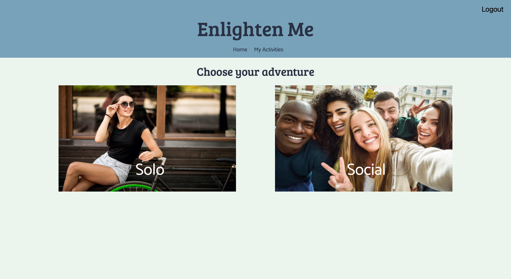
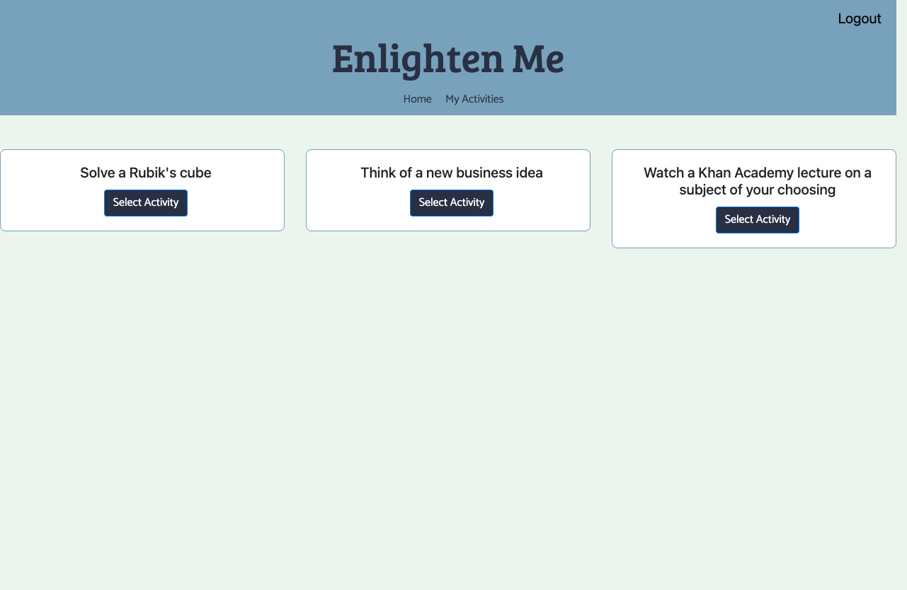
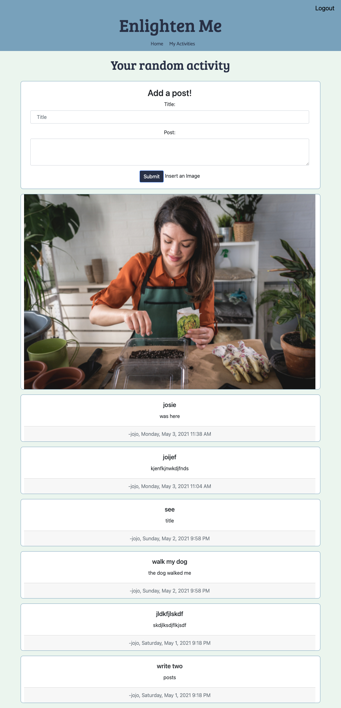

# Project 2: Enlighten Me

## Description

A full stack application that generates random activities given a users preferance between a solo or social experience. The user can choose there acitivites and create a post to document their experience.

## Table of Contents

-[Deployed Site](#deployed)
-[Project](#project)
-[Credits](#credits)
-[Questions](#questions)

## Deployed

[Deployed Site](https://fierce-spire-72565.herokuapp.com/)
 
## Project 

## Credits

[Josie Maldonado](https://github.com/JosieMald)

[Jenny Dinh](https://github.com/jdinh3)

[Mujinga Williams](https://github.com/mujinga21)

[Aftaab Dobani](https://github.com/aftaab-dobani)

## Questions

If you have any questions contact us at:

[Josie Maldonado](https://www.linkedin.com/in/josie-maldonado-437b909a/)

[Jenny Dinh](https://www.linkedin.com/in/jennifer-dinh-154a80116/)

[Mujunga Williams](https://www.linkedin.com/in/mujinga-williams-85183393/)

[Aftaab Dobani](https://www.linkedin.com/in/aftaab-dobani-57b4811b2/)

